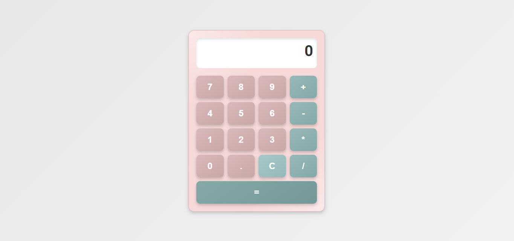

# 💻 **Calculadora**

¡Bienvenido a la **Calculadora **! 🚀 Este proyecto consiste en una simple calculadora implementada con **HTML**, **CSS** y **JavaScript**. La calculadora es capaz de realizar operaciones matemáticas básicas como suma, resta, multiplicación y división.

---

## 🔧 **Tecnologías utilizadas**

- **HTML**: Para la estructura y el contenido.
- **CSS**: Para los estilos y el diseño visual.
- **JavaScript**: Para la funcionalidad interactiva.

---

## 🧑‍💻 **Instalación**

Para ver o ejecutar la calculadora en tu máquina, sigue estos sencillos pasos:

1. **Clona el repositorio** a tu máquina:
   ```bash
   git clone https://github.com/tu_usuario/calculadora-web.git


## 🚀 **Funcionalidades**

- Realiza operaciones matemáticas básicas:
  - Suma ➕
  - Resta ➖
  - Multiplicación ✖️
  - División ➗
- Interfaz interactiva y simple.
- Respuestas rápidas y precisas.

 ## 📷 **Vista previa**


---
🧑‍💻 **Autor**  
Desarrollado por Avalob 😊

¡Gracias por visitar el repositorio de la Calculadora! 🚀
